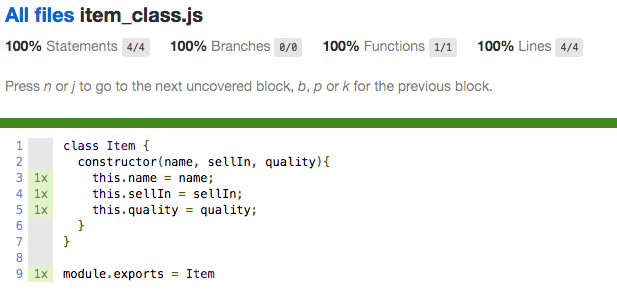
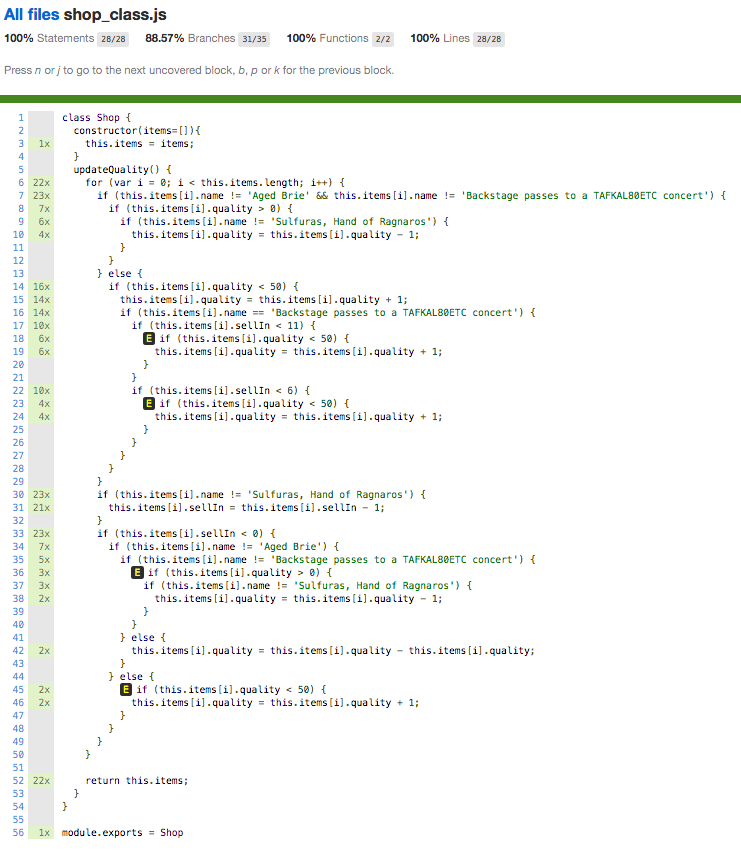

## Approach


### Prepping Code for Change
Test the entire code base before making any amendments (other than extracting Item Class for easier testing).

Results:
``` 
22 specs, 0 failures
Finished in 0.027 seconds
Randomized with seed 96476 (jasmine --random=true --seed=96476)
---------------|----------|----------|----------|----------|-------------------|
File           |  % Stmts | % Branch |  % Funcs |  % Lines | Uncovered Line #s |
---------------|----------|----------|----------|----------|-------------------|
All files      |      100 |    88.57 |      100 |      100 |                   |
 item_class.js |      100 |      100 |      100 |      100 |                   |
 shop_class.js |      100 |    88.57 |      100 |      100 |       18,23,36,45 |
---------------|----------|----------|----------|----------|-------------------|
```
The uncovered lines are the uncalled 'else' branches that cannot, in fact, be called.

Detailed coverage report for Item Class:


Detailed coverage report for Shop Class Class:


### Amending Code

#### Class Extraction

On completion of testing of legacy code, I made the following changes:

1. Extracted Items Class into a separate class
2. Extracted Aged Brie Class into a separate class
3. Extracted Normal Items into a separate class
4. Extracted Backstage Passes into a separate class

I then run the feature tests to make sure that the functionality initially present remained unaffected. All tests passed.

#### Adding Conjured Items Class

To accommodate the requested feature, I added a new Conjured Items class and relevant tests to confirm required functionality.

#### Test Results

```
26 specs, 0 failures
Finished in 0.034 seconds
Randomized with seed 46498 (jasmine --random=true --seed=46498)
--------------------------|----------|----------|----------|----------|-------------------|
File                      |  % Stmts | % Branch |  % Funcs |  % Lines | Uncovered Line #s |
--------------------------|----------|----------|----------|----------|-------------------|
All files                 |      100 |    97.14 |      100 |      100 |                   |
 agedBrie_class.js        |      100 |      100 |      100 |      100 |                   |
 backStagePasses_class.js |      100 |       90 |      100 |      100 |                 9 |
 conjuredItems_class.js   |      100 |      100 |      100 |      100 |                   |
 item_class.js            |      100 |      100 |      100 |      100 |                   |
 normalGoods_class.js     |      100 |      100 |      100 |      100 |                   |
 shop_class.js            |      100 |      100 |      100 |      100 |                   |
--------------------------|----------|----------|----------|----------|-------------------|

```

### Other Information

TODO:
1. Diagram of new class structure
2. Running tests
3. Possible Improvements
4. Why no unit tests?
5. Other ways to structure the program?
6. There is no 6.